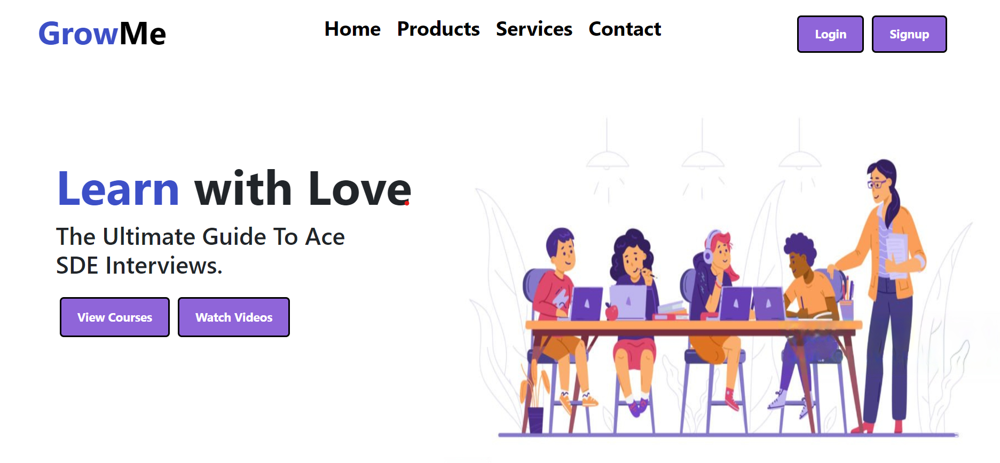

# Learning Platform

A web-based learning platform where students and teachers can interact. Teachers can create modules for students, conduct live classes, and engage in live chats.

## Features

- **User Authentication:** Secure login for students and teachers.
- **Module Creation:** Teachers can create and manage course modules.
- **Live Classes:** Real-time class sessions using WebRTC.
- **Live Chat:** Interactive chat during live classes.
- **File Uploads:** Upload and share educational materials.

## Technologies Used

- **Frontend:** React.js
- **Backend:** Node.js, Express.js
- **Database:** MongoDB
- **Real-Time Communication:** WebRTC, WebSocket
- **Authentication:** Bcrypt
- **File Management:** Multer

